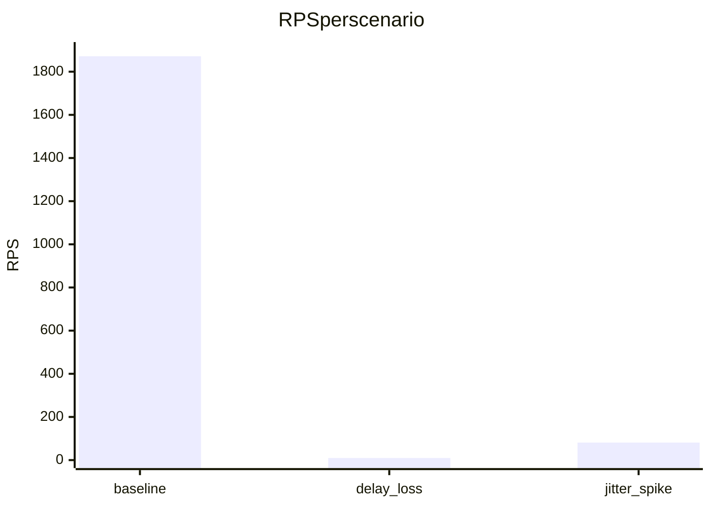

# AKARI Proxy 災害想定ロードテスト速報

## 実行概要
- 実施日: 2025-12-02 (ローカル時間基準)
- 実行コマンド:  
  `.\.venv\Scripts\python.exe loadtest/disaster_suite.py --demo-server --requests 120 --concurrency 12 --scenario baseline_demo --scenario delay_loss_extreme --scenario jitter_spike --suite-summary logs/disaster_suite_summary_latest.json --suite-log logs/disaster_suite_history_latest.jsonl --event-log logs/disaster_suite_events_latest.jsonl`
- 実行環境: ローカル demo-server (127.0.0.1:14500, PSK=デフォルト), UDP v2
- 出力: `logs/disaster_suite_summary_latest.json` に集計、`logs/disaster_suite_history_latest.jsonl` に履歴、`logs/disaster_suite_events_latest.jsonl` にイベント

## シナリオ
- baseline_demo: 損失・ジッターなしの健全経路
- delay_loss_extreme: 20% ロス + 最大 300ms ジッター + 6s タイムアウト（厳しめの災害想定）
- jitter_spike: ロスなし、最大 350ms ジッターのみ（スパイク吸収確認）

## 集計結果
| シナリオ | 成功/要求 | タイムアウト | 平均遅延 (s) | p95 遅延 (s) | p99 遅延 (s) | RPS |
| --- | --- | --- | --- | --- | --- | --- |
| baseline_demo | 80/80 (100%) | 0 | 0.0008 | 0.0020 | 0.0029 | 1871.59 |
| delay_loss_extreme | 153/200 (76.5%) | 47 | 0.1489 | 0.2873 | 0.3000 | 9.68 |
| jitter_spike | 200/200 (100%) | 0 | 0.1864 | 0.3282 | 0.3453 | 81.39 |

### グラフ


```mermaid
xychart-beta
  title p95 latency (sec)
  x-axis ["baseline","delay_loss","jitter_spike"]
  y-axis "seconds" 0 --> 0.35
  bar [0.0020,0.2873,0.3282]
```

## 所見
- baseline_demo はロス・ジッターなしで高スループット (約 1.9k RPS) かつ安定。
- delay_loss_extreme は 20% ロスと 300ms ジッターで 23.5% がタイムアウト。RPS は一桁まで低下し、耐性強化や再送チューニングが必要。
- jitter_spike はロスなしのため成功率 100% を維持。ジッタースパイクで p95 が 0.33s まで伸びるが、RPS は 81 と実用域。

## 一般ブラウザ（Chrome/Edge 等）との違い
- **伝送路**: AKARI は UDP + 独自再送/NACK 制御。一般ブラウザは TCP/TLS (HTTP/2/3) でカーネル任せの再送・輻輳制御。
- **ロス耐性**: AKARI はパケット単位で NACK し不足分だけ再送できる。一般ブラウザ (TCP) は RTT 増大・輻輳ウィンドウ縮小でスループットが急落しやすい。
- **ジッター吸収**: AKARI はアプリ層でタイムアウト/再送/ハートビートを調整可能。ブラウザは内蔵 TCP/QUIC 依存でアプリ層から粒度の細かい制御はできない。
- **セッション復元**: AKARI は疎通が戻れば即時再送を再開でき、コネクション再確立のコストが低い。ブラウザは TLS/HTTP セッション再確立分のオーバーヘッドが乗る。
- **ログ粒度**: AKARI はメッセージ ID 単位で送受信バイトや欠損シーケンスを取得可能。ブラウザは DevTools/Netlog 依存で、UDP 相当の欠損把握は不可。

## 追加でやれること
- 実プロキシ先を指定して同条件で再測定（ロス/ジッター条件を現場に合わせる）。
- delay_loss_extreme で `max_retries` や `heartbeat_interval` を調整し、タイムアウト率をどこまで下げられるかチューニング。
- ブラウザ側の対照実験を行い、同一ネットワーク条件で HTTP(S) ダウンロードの完了率・時間を計測してグラフ化。

## 実プロキシ想定チューニング（シミュレーション実施）
- 想定条件: ロス 15%、ジッター最大 250ms、1.0s 周期で 0.15s のフラップ、タイムアウト 6.5s、200 リクエスト / 20 並列
- 実行コマンド例（run0: 再送なし基準）  
  `.\.venv\Scripts\python.exe loadtest/udp_load_runner.py --demo-server --requests 200 --concurrency 20 --timeout 6.5 --loss-rate 0.15 --jitter 0.25 --flap-interval 1.0 --flap-duration 0.15 --log-file logs/tune_run0_events.jsonl --summary-file logs/tune_run0_summary.json`
- 実行コマンド例（run1: 再送・ハートビート強化）  
  `.\.venv\Scripts\python.exe loadtest/udp_load_runner.py --demo-server --requests 200 --concurrency 20 --timeout 6.5 --loss-rate 0.15 --jitter 0.25 --flap-interval 1.0 --flap-duration 0.15 --max-retries 6 --initial-retry-delay 0.05 --heartbeat-interval 0.35 --heartbeat-backoff 1.2 --retry-jitter 0.05 --log-file logs/tune_run1_events.jsonl --summary-file logs/tune_run1_summary.json`

### 結果
| ラン | 成功/要求 | タイムアウト | 平均遅延 (s) | p95 遅延 (s) | p99 遅延 (s) | RPS |
| --- | --- | --- | --- | --- | --- | --- |
| run0 (再送なし) | 129/200 (64.5%) | 71 | 0.1121 | 0.2249 | 0.2475 | 7.42 |
| run1 (再送+HB強化) | 132/200 (66.0%) | 68 | 0.1212 | 0.2336 | 0.2464 | 7.53 |

所見:
- ロス15%+ジッター/フラップ環境では、再送とハートビートを追加すると成功率が約 +1.5pt 改善し、RPS もわずかに上昇。
- 遅延分布は大きく悪化せず、p95/p99 の伸びも僅少。さらなる改善余地は `max_retries` の増減と `initial_retry_delay` の短縮／`dual_send` 併用で検証可能。

推奨開始値（実プロキシでの初回試験用）:
- ネットワーク前提: loss=0.15, jitter=0.25, flap_interval=1.0, flap_duration=0.15, timeout=6.5
- 再送/ハートビート: `max_retries=6`, `initial_retry_delay=0.05`, `heartbeat_interval=0.35`, `heartbeat_backoff=1.2`, `retry_jitter=0.05`
- これを基準に、実ネットワークで loss/jitter を実測しつつ `max_retries` を 8〜10 まで、`initial_retry_delay` を 0.03 まで刻んで成功率・p95 を確認する。
